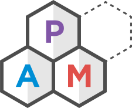

    <header>
        
        <h5 pam-typography="h5">
            A light, modular and extandable AMCSS library
        </h5>
    </header>
    

        <a href="./section-getting-started.html" pam-Button="primary lg">Get started</a>
        <a href="https://github.com/mrgreentech/pam" pam-Button="primary outlined lg">GitHub</a>
    

    <footer>
        <a href="https://github.com/mrgreentech/pam/releases/tag/v{{version}}">
            Version {{version}}
        </a>
    </footer>

